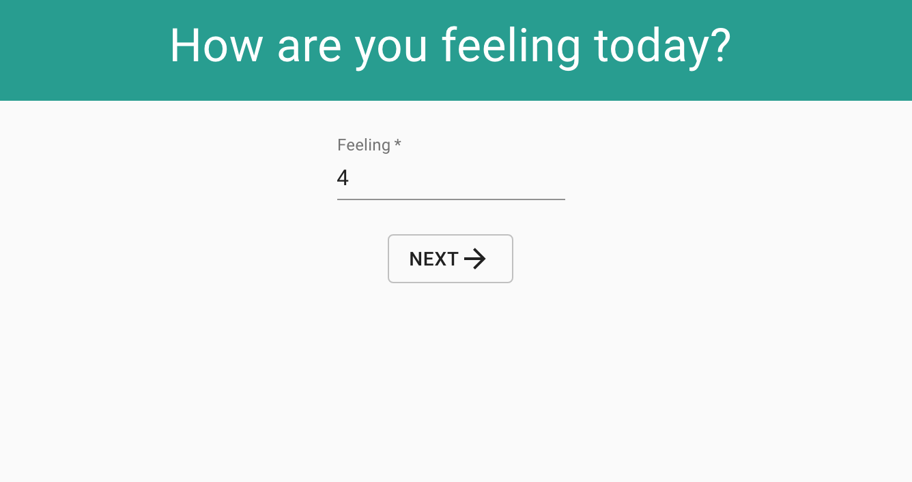
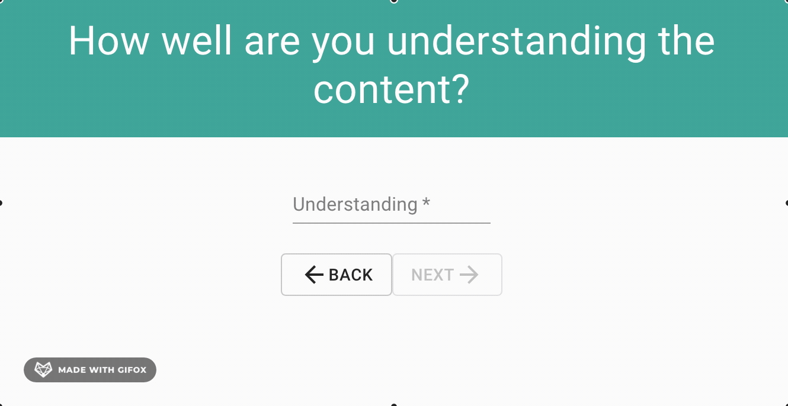

# Redux Feedback Loop

_Duration:_ Weekend Project

## Description
This is a multi-part form that allows users to leave feedback for today. There are 4 views for the form parts. Clicking next moves the user to the appropriate step in the feedback process. A separate review page displays the current feedback values with a submit button. When all feedback has been input, the app saves the feedback in the database.

In building this app, I practiced advanced relational database techniques by using react-redux and connecting a JSX-powered front-end through a node server to a SQL database.

## Prerequisites
To run this app, you will need:
* Node.js
* Postgres

## Install

To run this application:
* Create a database in Postgres called `prime_feedback`
* Execute the SQL commands from `data.sql`
* Run `npm install` from the project root directory
* Run `npm run server` to start the server

Now that the server is running, open a new terminal tab with cmd + t.
* Run `npm run client` to start the react client app

## Usage
Write a value in the input box and click _Next_ to move to the next feedback item. The first three feedback fields are required. To update or change a previous field, click the back button and input new information.
The review page displays all of the inputted data. To submit the feedback, click the submit button and the feedback will be sent to the database.
The final success page gives the option to return to the beginning of the form where the input fields will reset. The previously submitted data will remain on the database.
The `/admin` page displays all feedback in the database with the option to delete feedback. Refresh the page for the deleted data to be removed from the DOM or added data to be displayed on the DOM.

## Screenshot

